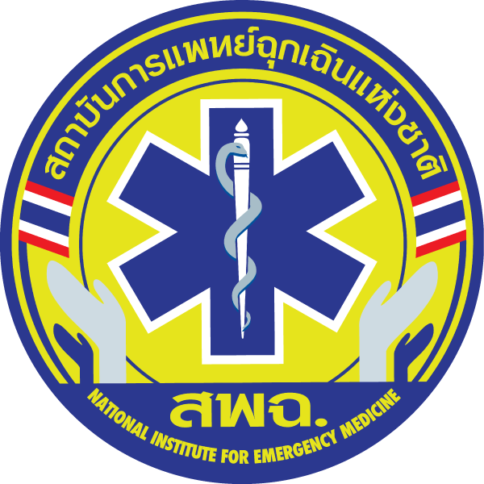

  
  <h1>🚑 NDEMS Demo: ระบบติดตามรถฉุกเฉิน</h1>
  
<strong>(National Digital Emergency Medical Services)</strong>

  
ระบบสาธิตการ Check-in และติดตามพิกัดชุดปฏิบัติการการแพทย์ฉุกเฉินแบบ Near Real-time 🗺️

---

## 🌟 จุดเด่นของระบบ (Features)

- 📡 **Near Real-time Sync:** ทำงานเชื่อมต่อข้ามอุปกรณ์ได้ทันทีผ่านระบบ MQTT (ไม่ต้องมี Database / Backend)
- 🏥 **Check-in อย่างรวดเร็ว:** เลือกหน่วยปฏิบัติการ รถ และรายชื่อบุคลากรได้ใน 3 ขั้นตอน
- 📍 **ระบบป้องกัน Check-in ซ้ำ:** รถคันไหนปฏิบัติงานอยู่ ระบบจะล็อกตัวเลือกไว้ (สีเทา) ป้องกันความผิดพลาด
- 🗺️ **Live Map Dashboard:** แผนที่แสดงรถพยาบาลและจุดเกิดเหตุ พร้อมบอกสถานะ (ALS/BLS) และประเมินเวลาจัดส่ง (Route & ETA)
- 🚪 **One-Click Check-out:** ยกเลิกภารกิจและนำรถออกจากแผนที่ได้ทันทีผ่านอุปกรณ์ที่ Check-in
- 🌐 **Static Hosting Ready:** ออกแบบมาเพื่อนำขึ้น **GitHub Pages** ได้ 100%

---

## 📱 คู่มือการใช้งานเบื้องต้น (User Guide)

### 1️⃣ ส่วนของหน้าจอแผนที่ส่วนกลาง (Live Map Dashboard)
- เปิดไฟล์ `map.html` หรือเข้าสู่ URL ของ GitHub Pages
- **สแกน QR Code** ที่ปรากฏทางมุมซ้ายล่างของแผนที่ เพื่อเข้าสู่หน้า Check-in ผ่านสมาร์ทโฟนหรือแท็บเล็ตของคุณ
- คุณจะเห็น **จุดเกิดเหตุ (🚨 หมุดกระพริบ)** สีแดงขึ้นบนแผนที่

### 2️⃣ การ Check-in (ฝั่งผู้ปฏิบัติการ / มือถือ)
1. สแกน QR Code แล้วหน้าจอจะพาคุณไปที่หน้า `checkin.html`
2. **ขั้นตอนที่ 1:** เลือก **ชุดปฏิบัติการ (รถพยาบาล)** ที่ต้องการ 
   - *(หากคันไหนกำลังปฏิบัติงานอยู่ จะเป็นสีเทาและมีคำว่า "ปฏิบัติงานอยู่" ต่อท้าย)*
3. **ขั้นตอนที่ 2:** เลือกรายชื่อ **ผู้ปฏิบัติการ** (เลือกได้สูงสุด 5 ท่าน)
4. **ขั้นตอนที่ 3:** ตรวจสอบข้อมูลทั้งหมด แล้วกดปุ่ม **"ยืนยัน Check-in"**
5. เมื่อสำเร็จ รถพยาบาลจะไปปรากฏบน **Live Map Dashboard** ในเวลาเสี้ยววินาที! ⚡

### 3️⃣ การสั่งการเส้นทาง (Route to Incident)
- ในหน้า **Live Map** เมื่อมีรถเข้ามาในระบบแล้ว จะแสดงอยู่ที่เมนูด้านขวามือ (Side Panel)
- คลิกที่ปุ่ม **"🗺 สั่งการ"** ที่การ์ดของรถคันนั้น
- แผนที่จะคำนวณเส้นทางไปหาจุดเกิดเหตุทันที พร้อมประเมินระยะทางและเวลา (นาที) บนเส้นทางสีฟ้า

### 4️⃣ การ Check-out (จบภารกิจ)
ทำได้ 2 วิธี:
- **วิธีที่ 1 (บนมือถือที่ Check-in):** ที่หน้าจอสำเร็จ จะมีปุ่ม **"🔴 Check-out ชุดนี้"** สามารถกดเพื่อนำรถออกจากระบบได้ทันที
- **วิธีที่ 2 (บนหน้าจอ Live Map):** ที่เมนูด้านขวา (Side Panel) จะมีปุ่ม **"🔴 Check-out"** สำหรับจบภารกิจรถคันนั้นจากส่วนกลาง

---

## 🛠 ข้อมูลทางเทคนิค (Tech Stack)

- **Frontend:** HTML5, Vanilla JavaScript, CSS3
- **Map Engine:** Leaflet.js, OpenStreetMap
- **Routing API:** OSRM (Open Source Routing Machine)
- **Geo-processing:** Turf.js
- **Real-time Engine:** MQTT (ผ่าน `wss://broker.emqx.io:8084/mqtt`)

  <i>💡 สร้างขึ้นเพื่อใช้ทดสอบการวางระบบโครงสร้างสถาปัตยกรรม (Architecture Demo)</i> 
  <i>โดยไม่มีการบันทึกข้อมูลส่วนบุคคลลงฐานข้อมูลถาวร</i>

